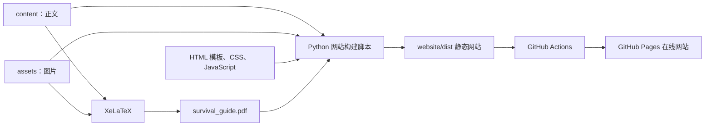

# 北京大学工学院新生生存手册

本仓库维护《北京大学工学院新生生存手册》的两种发布形式：

- 一份适合下载、打印和留档的 PDF；
- 一个适合手机和电脑在线阅读、浏览与搜索的静态网站。

项目最重要的设计是：**正文只维护一份**。正文写在 `content/` 目录的 LaTeX 文件中，这些文件既用于生成 PDF，也会由 Python 脚本转换成网页。因此，日常更新内容时不需要分别维护“PDF 版正文”和“网页版正文”。

## 一句话理解这个项目

维护者修改 `content/` 中的正文和 `assets/` 中的图片，在本地检查 PDF 与网站，然后把修改合并到 GitHub 的 `master` 分支；GitHub Actions 会自动生成并发布最新网站。



## 项目最终会产生什么

### PDF

根目录下的 `survival_guide.pdf` 是可以直接下载、打印和分发的完整手册，包含封面、封底、目录、页码以及书本排版。

### 静态网站

运行网站构建脚本后，会生成 `website/dist/`。其中包含首页、栏目页、正文页、搜索索引、图片、样式、脚本以及供读者下载的 PDF。

网站会保留正文、图片、脚注、表格、公式和主要标题层级，但不保留封面、封底、纸张分页、页眉页脚等只适用于纸质书的设计。较长的 LaTeX 章节会在网站中拆成多个专题页，方便阅读与搜索；这种拆分不会改变原始正文和 PDF 的章节结构。

`website/dist/` 是自动生成的临时产物，不需要提交到 Git，也不要直接编辑。每次构建时，这个目录都会被删除并重新生成。

## 技术栈

不需要理解全部技术才能更新内容。一般的文字和图片维护只需要会编辑 LaTeX 文件，并按照后文提供的命令进行检查。

### PDF 部分

- **LaTeX**：保存正文和书本排版信息；
- **ctex**：提供中文排版支持；
- **XeLaTeX**：实际编译 PDF；
- **latexmk**：自动执行多轮编译，处理目录、页码和交叉引用；
- **`styles/nexus.sty`**：控制 PDF 的章节、目录、页眉页脚和配色。

### 网站部分

- **Python 3 标准库**：读取 LaTeX、转换 HTML、复制资源并检查构建结果；
- **HTML5**：定义网页结构；
- **CSS3**：负责颜色、字体、排版和手机端适配；
- **原生 JavaScript**：负责全文搜索、手机菜单、图片放大和返回顶部；
- **MathJax（CDN）**：在浏览器中显示数学公式；
- **GitHub Actions**：在 `master` 更新后自动运行网站构建；
- **GitHub Pages**：托管并公开生成后的静态网站。

网站没有后端、数据库、Node.js、npm 或前端框架，也不需要安装 Python 第三方包。

## 目录和文件说明

```text
survival_guide/
├─ README.md                        # 你正在阅读的项目说明和维护手册
├─ main.tex                         # PDF 唯一编译入口；按顺序载入各章正文
├─ .latexmkrc                       # PDF 编译方式、文件名和中间目录配置
├─ survival_guide.pdf               # 已编译完成的 PDF，网站也会提供它下载
│
├─ content/                         # PDF 与网站共用的唯一正文来源
│  ├─ frontmatter.tex              # 前言和使用声明
│  ├─ chapter-01-basic-information.tex
│  ├─ chapter-02-course-selection.tex
│  ├─ chapter-03-study-life.tex
│  ├─ chapter-04-student-organizations.tex
│  ├─ chapter-05-positive-mindset.tex
│  ├─ chapter-06-freshman-timeline.tex
│  ├─ chapter-07-daily-life.tex
│  └─ backmatter.tex               # 后记和结语
│
├─ assets/                          # PDF 与网站共用的图片
├─ styles/
│  └─ nexus.sty                     # PDF 的视觉样式
├─ build/                           # PDF 编译中间文件，不需要手工维护
│
├─ scripts/
│  └─ build_website.py             # 将 LaTeX 转成网页的构建器和质量检查器
│
├─ website/
│  ├─ templates/                    # 首页、栏目页和正文页的 HTML 骨架
│  ├─ styles/main.css               # 网站的全部基础样式
│  ├─ scripts/main.js               # 搜索、菜单和图片交互
│  └─ dist/                         # 自动生成的网站，不手改、不提交
│
└─ .github/workflows/
   └─ deploy-pages.yml              # GitHub Pages 自动构建和发布流程
```

### 最常修改的文件

| 想做的事情 | 应修改的位置 |
| --- | --- |
| 修改正文、前言或后记 | `content/*.tex` |
| 新增或替换正文图片 | `assets/`，并在正文中更新引用 |
| 修改 PDF 排版 | `main.tex` 或 `styles/nexus.sty` |
| 修改网站页面骨架 | `website/templates/` |
| 修改网站颜色、字体和布局 | `website/styles/main.css` |
| 修改搜索、菜单或图片交互 | `website/scripts/main.js` |
| 修改网站栏目和专题切分 | `scripts/build_website.py` 中的页面配置 |
| 修改自动发布方式 | `.github/workflows/deploy-pages.yml` |

## 第一次使用：从 GitHub 克隆到本地

### 1. 安装基础工具

只生成和预览网站，需要：

- Git；
- Python 3.10 或更高版本，推荐使用与 GitHub Actions 一致的 Python 3.13；
- 一个文本编辑器，例如 Visual Studio Code。

如果还需要生成 PDF，则另外安装一套带有 XeLaTeX 和 latexmk 的 LaTeX 环境，例如 TeX Live 或 MiKTeX。当前 `.latexmkrc` 中包含 PowerShell 命令，因此在 Windows 上使用最直接；在 macOS 或 Linux 上编译 PDF 时可能需要相应调整。

可以在终端中检查是否安装成功：

```powershell
git --version
python --version
latexmk --version
```

如果 Windows 找不到 `python`，也可以尝试 `py --version`，并在后续命令中用 `py` 替代 `python`。

### 2. 克隆仓库

在希望保存项目的目录中运行：

```powershell
git clone https://github.com/1mmerse1/survival_guide2026.git
cd survival_guide2026
```

如果你维护的是自己的 fork，请把地址替换成自己的仓库地址。

### 3. 确认当前状态

```powershell
git status
git branch --show-current
```

正常情况下应位于 `master` 分支，并且没有尚未提交的本地修改。

### 4. 第一次生成网站

```powershell
python scripts/build_website.py
```

成功后会在 `website/dist/` 生成网站，并输出生成页面数量和首页位置。构建器同时会检查：

- 正文引用的图片是否存在；
- 是否出现网站转换器尚不支持的 LaTeX 命令；
- 脚注、图片、列表和表格的转换数量是否一致；
- 本地页面链接和页内锚点是否有效。

详细结果写在 `website/dist/build-report.json` 中；其中的 `status` 应为 `ok`。

### 5. 在浏览器中预览网站

```powershell
python scripts/build_website.py --serve
```

然后在浏览器中打开：

```text
http://127.0.0.1:8000/
```

按 `Ctrl+C` 停止预览服务器。源文件变化后，需要停止并重新运行构建，或者另开终端运行普通构建命令，再刷新浏览器。

### 6. 第一次生成 PDF

```powershell
latexmk main.tex
```

编译的中间文件会进入 `build/`，最终成品是根目录的 `survival_guide.pdf`。生成后应当实际打开 PDF，检查封面、目录、图片、分页和中文字体。

如果没有 `latexmk`，可以临时执行两次 XeLaTeX：

```powershell
xelatex -jobname=survival_guide main.tex
xelatex -jobname=survival_guide main.tex
```

不过日常维护仍推荐安装和使用 `latexmk`。

## 日常更新正文或图片

这是最常见的维护工作。

### 1. 先同步最新版本并创建工作分支

```powershell
git switch master
git pull origin master
git switch -c update-handbook-content
```

分支名可以按任务修改，例如 `update-course-selection` 或 `fix-typo`。

### 2. 修改正文

在 `content/` 中找到对应章节并编辑。尽量沿用现有文件中的 LaTeX 写法，因为 PDF 支持的 LaTeX 命令比网站转换器更多；加入特殊命令后，PDF 可能正常，但网站构建可能报“未知命令”。

修改图片时：

1. 把图片放进 `assets/`；
2. 在正文中引用该图片；
3. 尽量使用清晰、体积合理的 PNG、JPEG 等浏览器常见格式；
4. 如果是替换现有图片且不希望修改引用，可以保持原文件名不变。

### 3. 更新并检查 PDF

只要正文、图片或 PDF 排版有变化，就运行：

```powershell
latexmk main.tex
```

然后打开根目录的 `survival_guide.pdf` 检查结果。

> 重要：GitHub Actions 当前只生成网站，不会在云端编译 PDF。网站构建时只是把仓库中已有的 `survival_guide.pdf` 复制到网站。因此，正文变化后必须在本地重新生成并提交 PDF，否则网页内容可能已经更新，但网站下载到的 PDF 仍然是旧版。

### 4. 更新并检查网站

```powershell
python scripts/build_website.py
```

确认命令成功，并检查 `website/dist/build-report.json` 的 `status` 为 `ok`。随后可以启动本地预览：

```powershell
python scripts/build_website.py --serve
```

至少检查：

- 修改过的正文是否完整；
- 图片、脚注、表格和公式是否正常；
- 页面目录和前后导航是否有效；
- 搜索能否找到新内容；
- 桌面端和手机窄屏下是否可读；
- PDF 下载是否为刚刚生成的版本。

### 5. 提交和推送

```powershell
git status
git diff
git add -A
git commit -m "更新生存手册内容"
git push -u origin update-handbook-content
```

然后在 GitHub 上创建 Pull Request，请另一位维护者检查后合并到 `master`。即使拥有直接写入权限，也建议通过 Pull Request 合并，方便审阅和保留修改记录。

`website/dist/` 已被 `.gitignore` 忽略，不应出现在提交中。`survival_guide.pdf` 是二进制文件，无法像文字一样方便地解决合并冲突；只有确实重新生成了 PDF 时才提交它。

## 只修改网站界面或功能

如果正文内容没有变化，通常不需要重新编译 PDF。

- 页面结构：修改 `website/templates/`；
- 颜色、字号、间距和响应式布局：修改 `website/styles/main.css`；
- 搜索、手机菜单、图片放大等交互：修改 `website/scripts/main.js`；
- 栏目名称、导航关系、专题切分：修改 `scripts/build_website.py`。

修改后运行：

```powershell
python scripts/build_website.py
python scripts/build_website.py --serve
```

不要直接修改 `website/dist/`，因为下一次构建会覆盖其中的全部内容。

## 新增章节或调整网站栏目

新增一章不只是创建一个 `.tex` 文件，还需要同时处理 PDF 与网站的组织方式：

1. 在 `content/` 创建新的章节文件；
2. 在 `main.tex` 中添加对应的 `\input{content/文件名}`，确定 PDF 中的顺序；
3. 在 `scripts/build_website.py` 的 `PAGES` 配置中登记网页名称、标题、分类和切分范围；
4. 必要时在 `CATEGORIES` 中新增或调整栏目；
5. 重新生成 PDF 和网站，并完整检查导航、搜索和链接。

这类改动涉及网站结构，建议由了解构建脚本的维护者完成或复核。

## 封面和封底

PDF 使用以下文件：

- `assets/cover-third-edition.png`：封面；
- `assets/封底.jpg`：封底。

替换设计时保持文件名不变，再运行 `latexmk main.tex`。封面和封底属于书本版式，不会显示在网页正文中。

## GitHub Pages 如何自动发布

自动发布配置位于 `.github/workflows/deploy-pages.yml`。

当有新提交进入 `master` 分支时，GitHub 会自动执行：

1. 下载仓库的最新内容；
2. 准备 Python 环境；
3. 运行 `python scripts/build_website.py`；
4. 上传 `website/dist/`；
5. 把该版本发布到 GitHub Pages。

因此，维护者不需要提交 `website/dist/`，也不需要每次手工上传网页文件。其他分支上的提交不会更新正式网站，必须在合并进 `master` 后才会触发发布。

### 仓库首次启用 Pages

仓库所有者或具有相应权限的维护者需要完成一次设置：

```text
Settings → Pages → Build and deployment → Source → GitHub Actions
```

只需配置一次。之后进入：

```text
Actions → Build and deploy website
```

确认最新运行中的 `build` 和 `deploy` 都显示绿色勾号。也可以用 `Run workflow` 在 `master` 上手动重新发布。

正式网站地址通常为：

```text
https://仓库所有者用户名.github.io/仓库名/
```

本仓库启用 Pages 后预计为：

```text
https://1mmerse1.github.io/survival_guide2026/
```

### 自动更新的准确含义

- `master` 有新提交：自动重新构建并更新该仓库的网站；
- 只修改本地文件但没有推送：不会更新；
- 只推送到功能分支但没有合并：不会更新；
- 原仓库更新后，个人 fork 不会自动同步；fork 需要先同步 `master`，它自己的网站才会更新；
- 网页正文会从最新 LaTeX 自动生成，但 PDF 必须由维护者提前在本地编译并提交。

## 推荐的完整工作流程

一次普通的内容更新可以概括为：

```text
同步 master
→ 创建工作分支
→ 修改 content/ 和 assets/
→ 本地生成并检查 PDF
→ 本地生成并检查网站
→ 提交并推送工作分支
→ 创建 Pull Request
→ 审阅并合并到 master
→ GitHub Actions 自动发布
→ 打开在线网站验收
```

提交前建议确认：

- `git status` 中没有无关文件；
- PDF 已重新生成并人工查看；
- 网站本地构建成功；
- `build-report.json` 的状态为 `ok`；
- `website/dist/` 没有被提交；
- 本次提交只处理一个清晰主题；
- 提交说明能够让其他人看懂修改目的。

## 常见问题

### 网站构建提示找不到 Python

先检查：

```powershell
python --version
```

Windows 也可以尝试：

```powershell
py scripts/build_website.py
```

### 网站构建提示未知 LaTeX 命令

说明正文使用了网站转换器尚未支持的命令。优先参考现有正文，换成已有的等价写法；如果必须保留新命令，则需要在 `scripts/build_website.py` 中补充转换逻辑。

不要忽略这个错误并手工修改 `website/dist/`，因为自动发布时仍会再次失败。

### 网站构建提示图片不存在

检查图片是否确实位于 `assets/`，文件名、扩展名和正文引用是否完全一致。中文、英文大小写和空格都可能导致引用不匹配；GitHub 的 Linux 构建环境区分文件名大小写。

### PDF 编译失败

先确认 XeLaTeX、latexmk 和中文 LaTeX 宏包已经安装。查看终端输出和 `build/` 中的日志，错误通常会指出对应的 `.tex` 文件和附近行号。

### 网页更新了，但下载的 PDF 没更新

这是因为 GitHub Actions 不负责编译 PDF。请在本地运行 `latexmk main.tex`，确认根目录的 `survival_guide.pdf` 已改变，然后提交该 PDF 并合并到 `master`。

### Actions 出现黄色 warning

黄色 warning 不一定代表发布失败。判断是否成功应看整个工作流，以及 `build`、`deploy` 是否都是绿色勾号。红色叉号才表示需要打开对应步骤查看错误。

### 在线网站没有立即变化

先确认修改已经进入 `master`，再到 Actions 检查最新工作流。部署成功后仍可能需要等待几分钟，并刷新浏览器缓存。

## 协作约定

1. 开始工作前先同步 `master`，并为每项任务创建独立分支。
2. 正文维护者主要修改 `content/` 和 `assets/`；网站界面维护者主要修改 `website/`。
3. 修改正文后同时检查 PDF 和网站，避免两个版本表现不一致。
4. 不直接编辑或提交 `website/dist/` 和 `build/` 中的中间文件。
5. 不要在未确认的情况下覆盖别人生成的 `survival_guide.pdf`。
6. 优先通过 Pull Request 合并，即使维护者拥有直接推送权限。
7. 一次提交尽量只处理一个主题，例如“正文更新”“修复错字”“网站样式”或“自动部署”。

遵循以上流程后，正文只需维护一次，PDF 和网站就能长期保持一致；网站在内容进入 `master` 后会由 GitHub 自动重新构建并发布。
